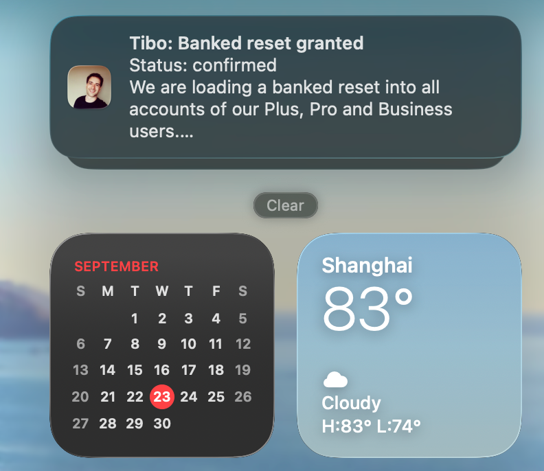
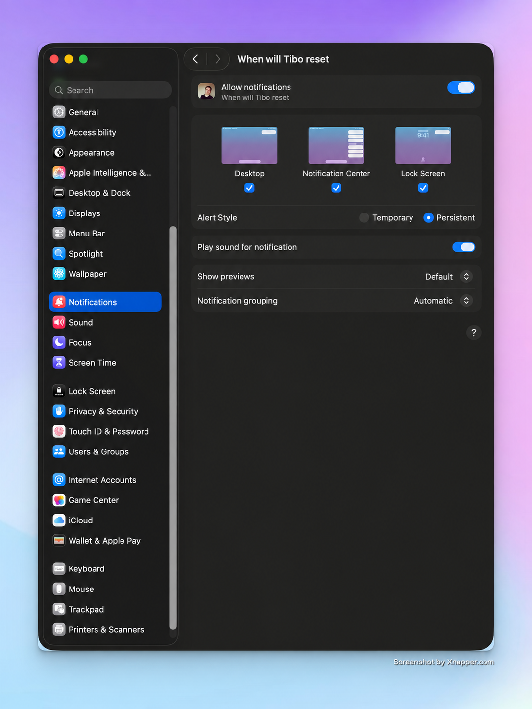
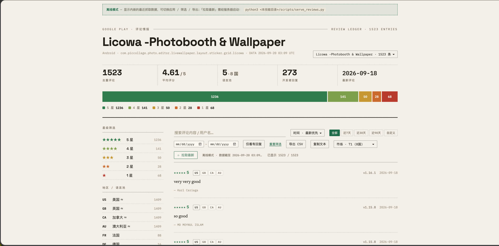

# linversion/skills

English | [简体中文](README.zh.md)

[](https://skills.sh/linversion/skills)

A collection of personal skills for Codex and other AI agents, spanning productivity tools and AI image evaluation. Each skill can be installed and used independently.

## Prerequisites

- Install [Node.js](https://nodejs.org/) to use `npx` to install skills.
- Some skills have additional runtime requirements; see their individual documentation.

## Installation

Install the full collection:

```bash
npx skills add linversion/skills
```

Or install only the skills you need:

```bash
npx skills add linversion/skills --skill when-will-tibo-reset
npx skills add linversion/skills --skill app-reviews
npx skills add linversion/skills --skill image-score
```

`npx skills` detects the agents installed on your machine and links skills into their discovery directories so you can update them later. See the [Skills CLI](https://github.com/vercel-labs/skills) for more installation options.

## Updating

Update all installed skills:

```bash
npx skills update
```

You can also update an individual skill, for example:

```bash
npx skills update app-reviews
```

## Available Skills

### Productivity

#### When will Tibo reset

Checks AIHot's Codex reset updates every hour and sends a native macOS notification when a new event appears or an existing event changes status. You can also forward updates to Feishu, DingTalk, or WeCom. First-time setup asks whether you prefer Chinese or English and whether to enable webhooks.

- Requires macOS 11+ and Python 3. The universal notification helper app is bundled with the skill, so Xcode and Command Line Tools are not required. On first launch, macOS may ask you to approve the app in Gatekeeper and grant notification permission.
- Notifications support persistent alerts and sound. Enable both in macOS System Settings → Notifications.
- Skill: [`skills/productivity/when-will-tibo-reset`](skills/productivity/when-will-tibo-reset/)

**Notification preview**

<p align="center">
  
</p>

**macOS notification settings**

<p align="center">
  
</p>

#### App Reviews

Collects reviews from Google Play and the iOS App Store, then brings them together in a local dashboard for tracking feedback across apps.

- Switch between apps to view ratings, review counts, and region and language distributions.
- Compare T1/T2/T3 market tiers and filter by time, star rating, or region.
- Export reviews as CSV or text, or browse previously saved data offline.
- Skill: [`skills/productivity/app-reviews`](skills/productivity/app-reviews/)

**Review dashboard**

<p align="center">
  
</p>

### Engineering

#### Image Score

Uses large language models to evaluate AI-generated images in a structured way, helping you compare models or prompts and identify opportunities to improve results.

- Scores 17 criteria across five dimensions: quality, aesthetics, prompt alignment, realism, and creativity.
- Includes a rationale for each score, plus a summary and complete JSON output for review and comparison.
- Supports OpenAI-compatible APIs and Gemini.
- Skill: [`skills/engineering/image-score`](skills/engineering/image-score/)

Run an example from the skill directory:

```bash
python scripts/judge.py --image output.png --prompt "a cat wearing a spacesuit on Mars"
```
